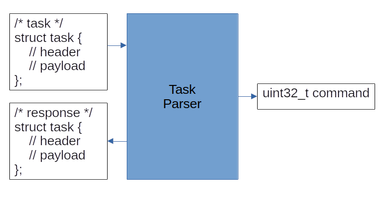

# HDL Task Parser

An example of a task message parser written in synthesizable SystemVerilog. 

## Running Simulations 

Each module in this project has a corresponding simulation in the __sim__
directory that exercises most (if not all) happy use cases as well as the 
various failure modes and edge cases. Simulations are implemented using the 
`cocotb` framework and `verilator`. To faciliate the install of cocotb,
__sim/requirements.txt__ can be used to install all the necessary Python 
dependencies. Verilator can be installed from the system package manager or by 
referencing the official
[documentation](https://verilator.org/guide/latest/install.html). 

Simulation execution is controlled by a Makefile in the root of each simulation 
directory. These Makefiles provide various targets that perform common simulation
tasks.

| Make Target | Purpose                                                  |
| ----------- | -------------------------------------------------------- |
| sim         | Run the simulation                                       |
| wave        | Run the simulation and open the dump.vcd file in GtkWave |
| lint        | Run the Verilator linter on the SystemVerilog source     |
| all         | Maps to the sim Make target                              |

It is recommended that the Python dependencies be installed in some kind of 
managed environment (e.g. `venv`). The script snippet below shows how to setup
a Python virtual environment and run a simulation.

```bash
cd sim 
python3 -m venv venv             # creates a folder named venv 
source venv/bin/activate         # activate the environment
pip3 install -r requirements.txt # install Python dependencies    
cd ./some-module                 # each module has their own folder
make lint                        # run lint on the SystemVerilog files 
make                             # run the sim 
make wave                        # re-run the sim and open the wave file
```

## Basic Theory

At a previous job, I spent a lot of time writing embedded applications that
were responsible for acting and responding to tasks over Ethernet connections.
The implementation usually involved defining C structs that represented task 
messages conforming to an ICD. The ICD would define all possible application 
messages, their purpose, and the memory layout. The role of the task parser was 
to transform these messages into data structures needed for task execution. 
Most executions would occur in custom IP written by other designers. To make 
life easier on the IP designers, their data input (output from the task parser) 
would be a single command word of some predefined width. The width would be 
determined at the start of the project and be large enough to handle all 
execution needs of the application. This command word structure would typically
be accompanied by its own separate ICD. For the purposes of this project, 
command words can be assumed to be 32-bits wide.



For 99.99% of the tasks, a software implementation was fast enough to meet the 
application requirements. The latency caused by the Ethernet LAN stack and 
other background work on the task parser's processor were negligible compared
to the custom IP latency (think relay switching speeds). However, in the 0.01% 
of tasks where latency was required to be as minimal as possible, a faster/parallel 
hardware solution was needed. As stated earlier tasks were generally sent over
Ethernet, and the FPGA vendor's Ethernet MAC IP just happened to use streaming
interfaces as the main mechanism for moving packets. This allowed shim logic to
be placed between the Ethernet MAC and the processor running the software task 
parser. The shim logic was responsible for scanning packets from the Ethernet 
MAC and determining if the packet was one of the application's tasks. If the 
packet was an application task and the task ID was flagged for hardware 
processing, the shim would redirect that packet to an HDL task parser 
implementation.


HDL task parsers typically only implemented a subset of a given application's 
ICD. Only tasks that absolutely needed acceleration were implemented in HDL. It 
was preferrable to run tasks in the software task parser since that parser had 
access to debug logging and many other troubleshooting facilites not usually 
found in an HDL environment.

